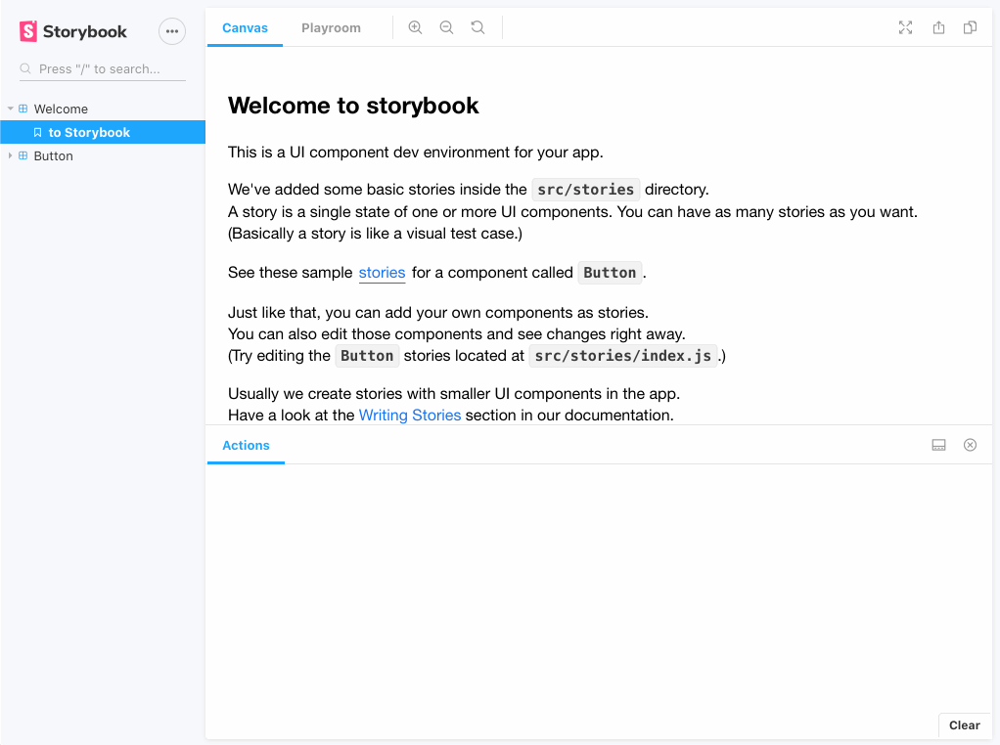

# Storybook Playroom Addon

[](https://www.npmjs.com/package/storybook-addon-playroom)
[](https://github.com/rbardini/storybook-addon-playroom/actions)
[](https://david-dm.org/rbardini/storybook-addon-playroom)
[](https://david-dm.org/rbardini/storybook-addon-playroom?type=dev)

Design with [Playroom](https://github.com/seek-oss/playroom) inside [Storybook](https://storybook.js.org), using each story source as a starting point.

[Live demo](https://storybook-addon-playroom.netlify.com)



## Installation

```console
npm install --save-dev storybook-addon-playroom
```

within `.storybook/main.js`:

```js
module.exports = {
  addons: ['storybook-addon-playroom']
}
```

within `.storybook/preview.js`:

```js
import { addDecorator } from '@storybook/react';
import { withPlayroom } from 'storybook-addon-playroom';

addDecorator(withPlayroom);
```

See [`example`](example) for a minimal working setup.

## Configuration

The addon can be configured globally and per story with the `playroom` parameter. The following options are available:

| Option     | Description                          | Default                 |
|:-----------|:-------------------------------------|:------------------------|
| `url`      | the Playroom URL                     | `http://localhost:9000` |
| `disabled` | whether to disable the addon         | `false`                 |

### Global configuration

To add Playroom to all stories, call `addParameters` in `.storybook/preview.js`:

```js
import { addParameters } from '@storybook/react';

addParameters({
  playroom: {
    url: 'http://localhost:9000', // your Playroom URL (default)
  },
});
```

### Per-story configuration

To configure Playroom for a single story or a set of stories, add the `playroom` parameter:

```js
export default {
  title: 'Stories',
  parameters: {
    playroom: {
      url: 'http://localhost:9000',
    },
  },
};

export const myStory = () => '<h1>Hello World</h1>';
myStory.story = {
  parameters: {
    playroom: {
      url: 'http://localhost:9000',
    },
  },
};
```
